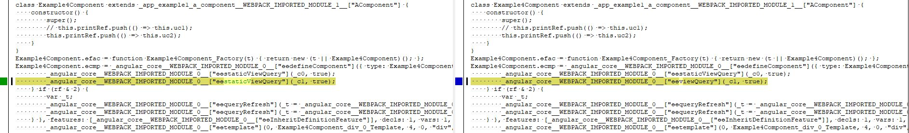

## ViewChild Static attribute ([link](https://angular.io/api/core/ViewChild))

- If static is set to True, angular will use [ɵɵstaticViewQuery](https://github.com/angular/angular/blob/698b0288bee60b8c5926148b79b5b93f454098db/packages/core/src/render3/query.ts#L456) (Creates new QueryList for a static view query).

- If static is set to False, Angular will use [ɵɵviewQuery](https://github.com/angular/angular/blob/698b0288bee60b8c5926148b79b5b93f454098db/packages/core/src/render3/query.ts#L470) (Creates new QueryList, stores the reference in LView and returns QueryList).

When Angular will call [ɵɵqueryRefresh](https://github.com/angular/angular/blob/698b0288bee60b8c5926148b79b5b93f454098db/packages/core/src/render3/query.ts#L431) method (*Refreshes a query by combining matches from all active views and removing matches from deleted views*) and if the query is static, it will be never refreshed after the creation of the view (improve performance), but now if the query is not static it will be refreshed each time (performance impact).

## Output compiler example




```javascript
// Static is set to True
const _c0 = ["uc1"];
const _c1 = ["uc2"];
function Example4Component_div_0_Template(rf, ctx) { if (rf & 1) {
    _angular_core__WEBPACK_IMPORTED_MODULE_0__["ɵɵelementStart"](0, "div", null, 1);
    _angular_core__WEBPACK_IMPORTED_MODULE_0__["ɵɵelementStart"](2, "p");
    _angular_core__WEBPACK_IMPORTED_MODULE_0__["ɵɵtext"](3, "My amazing content !");
    _angular_core__WEBPACK_IMPORTED_MODULE_0__["ɵɵelementEnd"]();
    _angular_core__WEBPACK_IMPORTED_MODULE_0__["ɵɵelementEnd"]();
} }
class Example4Component extends _app_example1_a_component__WEBPACK_IMPORTED_MODULE_1__["AComponent"] {
    constructor() {
        super();
        // this.printRef.push(() => this.uc1);
        this.printRef.push(() => this.uc2);
    }
}
Example4Component.ɵfac = function Example4Component_Factory(t) { return new (t || Example4Component)(); };
Example4Component.ɵcmp = _angular_core__WEBPACK_IMPORTED_MODULE_0__["ɵɵdefineComponent"]({ type: Example4Component, selectors: [["app-example4"]], viewQuery: function Example4Component_Query(rf, ctx) { if (rf & 1) {
        _angular_core__WEBPACK_IMPORTED_MODULE_0__["ɵɵstaticViewQuery"](_c0, true);
        _angular_core__WEBPACK_IMPORTED_MODULE_0__["ɵɵstaticViewQuery"](_c1, true);
    } if (rf & 2) {
        var _t;
        _angular_core__WEBPACK_IMPORTED_MODULE_0__["ɵɵqueryRefresh"](_t = _angular_core__WEBPACK_IMPORTED_MODULE_0__["ɵɵloadQuery"]()) && (ctx.uc1 = _t.first);
        _angular_core__WEBPACK_IMPORTED_MODULE_0__["ɵɵqueryRefresh"](_t = _angular_core__WEBPACK_IMPORTED_MODULE_0__["ɵɵloadQuery"]()) && (ctx.uc2 = _t.first);
    } }, features: [_angular_core__WEBPACK_IMPORTED_MODULE_0__["ɵɵInheritDefinitionFeature"]], decls: 1, vars: 1, consts: [[4, "ngIf"], ["uc2", ""]], template: function Example4Component_Template(rf, ctx) { if (rf & 1) {
        _angular_core__WEBPACK_IMPORTED_MODULE_0__["ɵɵtemplate"](0, Example4Component_div_0_Template, 4, 0, "div", 0);
    } if (rf & 2) {
        _angular_core__WEBPACK_IMPORTED_MODULE_0__["ɵɵproperty"]("ngIf", true);
    } }, directives: [_angular_common__WEBPACK_IMPORTED_MODULE_2__["NgIf"]], styles: ["... */"] });
/*@__PURE__*/ (function () { _angular_core__WEBPACK_IMPORTED_MODULE_0__["ɵsetClassMetadata"](Example4Component, [{
        type: _angular_core__WEBPACK_IMPORTED_MODULE_0__["Component"],
        args: [{
                selector: 'app-example4',
                templateUrl: './example4.component.html',
                styleUrls: ['../example1/example1.component.sass']
            }]
    }], function () { return []; }, { uc1: [{
            type: _angular_core__WEBPACK_IMPORTED_MODULE_0__["ViewChild"],
            args: ['uc1', { static: true }]
        }], uc2: [{
            type: _angular_core__WEBPACK_IMPORTED_MODULE_0__["ViewChild"],
            args: ['uc2', { static: true }]
        }] }); })();


/***/ }),
```

```javascript
// Static is set to False
const _c0 = ["uc1"];
const _c1 = ["uc2"];
function Example4Component_div_0_Template(rf, ctx) { if (rf & 1) {
    _angular_core__WEBPACK_IMPORTED_MODULE_0__["ɵɵelementStart"](0, "div", null, 1);
    _angular_core__WEBPACK_IMPORTED_MODULE_0__["ɵɵelementStart"](2, "p");
    _angular_core__WEBPACK_IMPORTED_MODULE_0__["ɵɵtext"](3, "My amazing content !");
    _angular_core__WEBPACK_IMPORTED_MODULE_0__["ɵɵelementEnd"]();
    _angular_core__WEBPACK_IMPORTED_MODULE_0__["ɵɵelementEnd"]();
} }
class Example4Component extends _app_example1_a_component__WEBPACK_IMPORTED_MODULE_1__["AComponent"] {
    constructor() {
        super();
        // this.printRef.push(() => this.uc1);
        this.printRef.push(() => this.uc2);
    }
}
Example4Component.ɵfac = function Example4Component_Factory(t) { return new (t || Example4Component)(); };
Example4Component.ɵcmp = _angular_core__WEBPACK_IMPORTED_MODULE_0__["ɵɵdefineComponent"]({ type: Example4Component, selectors: [["app-example4"]], viewQuery: function Example4Component_Query(rf, ctx) { if (rf & 1) {
        _angular_core__WEBPACK_IMPORTED_MODULE_0__["ɵɵstaticViewQuery"](_c0, true);
        _angular_core__WEBPACK_IMPORTED_MODULE_0__["ɵɵviewQuery"](_c1, true);
    } if (rf & 2) {
        var _t;
        _angular_core__WEBPACK_IMPORTED_MODULE_0__["ɵɵqueryRefresh"](_t = _angular_core__WEBPACK_IMPORTED_MODULE_0__["ɵɵloadQuery"]()) && (ctx.uc1 = _t.first);
        _angular_core__WEBPACK_IMPORTED_MODULE_0__["ɵɵqueryRefresh"](_t = _angular_core__WEBPACK_IMPORTED_MODULE_0__["ɵɵloadQuery"]()) && (ctx.uc2 = _t.first);
    } }, features: [_angular_core__WEBPACK_IMPORTED_MODULE_0__["ɵɵInheritDefinitionFeature"]], decls: 1, vars: 1, consts: [[4, "ngIf"], ["uc2", ""]], template: function Example4Component_Template(rf, ctx) { if (rf & 1) {
        _angular_core__WEBPACK_IMPORTED_MODULE_0__["ɵɵtemplate"](0, Example4Component_div_0_Template, 4, 0, "div", 0);
    } if (rf & 2) {
        _angular_core__WEBPACK_IMPORTED_MODULE_0__["ɵɵproperty"]("ngIf", true);
    } }, directives: [_angular_common__WEBPACK_IMPORTED_MODULE_2__["NgIf"]], styles: ["..."] });
/*@__PURE__*/ (function () { _angular_core__WEBPACK_IMPORTED_MODULE_0__["ɵsetClassMetadata"](Example4Component, [{
        type: _angular_core__WEBPACK_IMPORTED_MODULE_0__["Component"],
        args: [{
                selector: 'app-example4',
                templateUrl: './example4.component.html',
                styleUrls: ['../example1/example1.component.sass']
            }]
    }], function () { return []; }, { uc1: [{
            type: _angular_core__WEBPACK_IMPORTED_MODULE_0__["ViewChild"],
            args: ['uc1', { static: true }]
        }], uc2: [{
            type: _angular_core__WEBPACK_IMPORTED_MODULE_0__["ViewChild"],
            args: ['uc2', { static: false }]
        }] }); })();


/***/ }),
```

## ViewChild Read attribute ([link](https://angular.io/api/core/ViewChild))

The ViewChild Read attribute allow you to read a different token from the queried elements.
